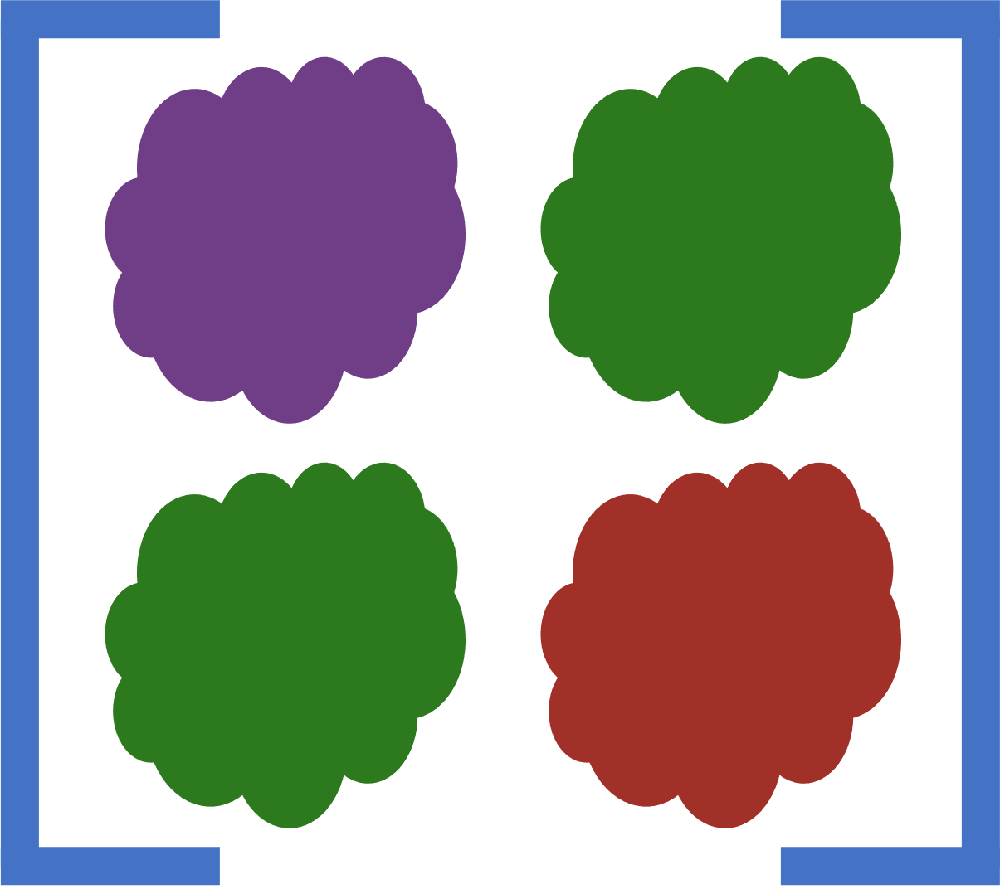

# CloudCovErr.jl 

[![][docs-dev-img]][docs-dev-url]
[![][action-img]][action-url]
[![][codecov-img]][codecov-url]
[![][arxiv-img]][arxiv-url]

Pipeline for debiasing and improving error bar estimates for photometry on top of structured/filamentary background. The procedure first estimates the covariance matrix of the residuals from a previous photometric model and then computes corrections to the estimated flux and flux uncertainties.

## Installation

**CloudCovErr** is a registered package so a stable version can be installed using `Pkg.add`.

```julia
import Pkg
Pkg.add("CloudCovErr")
```

For the most recent development version, install directly from the GitHub

```julia
import Pkg
Pkg.add(url="https://github.com/andrew-saydjari/CloudCovErr.jl")
```

Currently, we only support compatibility with linux and macOS in order to easily interface with dependencies of [crowdsource](https://github.com/schlafly/crowdsource). Due to older versions of Julia bundling outdated libstcd++, we only support Julia 1.6+ again to make interfacing with python-based photometric pipelines easier (see [issue](https://github.com/JuliaLang/julia/issues/34276)). However, workarounds exist for both problems. Please open an issue if there is some compatibility you would like supported.  

## Documentation

Detailed documentation can be found [here][docs-dev-url].

Users may also find it helpful to consult the [manuscript](https://arxiv.org/abs/2201.07246) accompanying this release.

## Example

A key ingredient to our flux debiasing and uncertainty estimation algorithm is a good estimate of the **distribution** of possible backgrounds behind a star. An example is shown below.

<!-- [![][infill-img]][infill-url] -->

## Contributing and Questions

This is a new piece of software. [Filing an
issue](https://github.com/andrew-saydjari/CloudCovErr.jl/issues/new) to report a
bug or request a feature is extremely valuable in helping us prioritize what to work on, so don't hesitate.

<!-- URLS -->
[action-img]: https://github.com/andrew-saydjari/CloudCovErr.jl/workflows/Unit%20test/badge.svg
[action-url]: https://github.com/andrew-saydjari/CloudCovErr.jl/actions

[docs-dev-img]: https://img.shields.io/badge/docs-dev-blue.svg
[docs-dev-url]: https://andrew-saydjari.github.io/CloudCovErr.jl/dev/

[codecov-img]: https://codecov.io/github/andrew-saydjari/CloudCovErr.jl/coverage.svg?branch=main
[codecov-url]: https://codecov.io/github/andrew-saydjari/CloudCovErr.jl?branch=main

[infill-img]: docs/src/assets/infill_radius_white.gif
[infill-url]: https://faun.rc.fas.harvard.edu/saydjari/CloudCovErr/thr_test.mp4

[arxiv-img]: https://img.shields.io/badge/arXiv-2201.07246-00cc00.svg
[arxiv-url]: https://arxiv.org/abs/2201.07246
